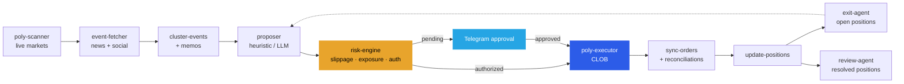

<div align="center">

# ⚡ PolyTradingUltra

### An autonomous, 24/7 trading operating system for [Polymarket](https://polymarket.com)

**Scan → Research → Propose → Risk-Check → Authorize → Execute → Reconcile → Review.** <br/>
All of it, on loop. All of it, on a single laptop or a tiny EC2 box. All of it, with SQLite as the one source of truth.

[](https://www.python.org/downloads/)
[](https://sqlite.org/)
[](https://docs.polymarket.com/)
[](https://core.telegram.org/bots)
[](#)
[](#license)

</div>

---

> **Heads-up on the name.** This project was originally called `polymarket-mvp`. The GitHub repo and top-level directory were rebranded to **PolyTradingUltra**, but the Python package name (`polymarket_mvp`), CLI entry points (`polymarket-autopilot`, `poly-scanner`, …), env vars (`POLYMARKET_MVP_DB_PATH`), launchd/systemd units (`com.polymarket.*`, `mvp-autopilot.service`), and the SQLite filename (`polymarket_mvp.sqlite3`) were intentionally left untouched so a live deployment could be renamed without a redeploy. If you see `polymarket_mvp` anywhere inside — that's on purpose, that's us.

## 🎯 What this is

PolyTradingUltra is a **local-first, self-hosted prediction-market trading OS**. It isn't a notebook, it isn't a bot script, and it isn't a black-box "AI trader." It's a long-running supervisor that owns the whole path from *"this market just appeared"* to *"we have a filled position, and here's the post-mortem."*

Every piece of state lives in a single SQLite file. Every decision leaves an audit trail. Every step is independently restartable. You can kill the whole stack mid-cycle, come back an hour later, and the system will pick up exactly where it left off.

It was designed for the kind of operator who wants:

- 🧠 **LLM-augmented judgment** (via OpenClaw / an LLM adapter) for *memo*, *supervisor*, *exit*, and *review* nodes — with a deterministic fallback so nothing is load-bearing on AI
- 🛡️ **Explicit risk, authorization, and kill-switch layers** between "the model thinks this is a trade" and "we sent real USDC to the CLOB"
- 📱 **Human-in-the-loop approvals over Telegram** for anything outside a pre-authorized strategy
- 🖥️ **Two web dashboards** (business state + an independent control plane that survives even if the main stack is down)
- 📊 **Full replay capability** from the DB — positions, fills, reconciliations, research memos, exit decisions, post-trade reviews

## 🏗️ Architecture



### Four-layer separation

| Layer | What lives there | Why |
|---|---|---|
| **Decision** | OpenClaw / LLM adapters for memo, supervisor, exit, review | Judgment calls — with deterministic fallback so the pipeline never stops when the LLM is down |
| **Execution** | Python pipeline: scan, fetch context, risk, place orders, sync fills | Pure code, fully testable, no prompts in the hot path |
| **State** | SQLite — `proposals`, `approvals`, `executions`, `positions`, `reconciliations`, `reviews`, … | One file, one source of truth, cheap to back up |
| **Ops** | `:8787` business dashboard · `:8788` independent control plane | You can start / stop / restart the whole system from `:8788` even if `:8787` is dead |

### The two web surfaces

- **`http://127.0.0.1:8787/ops`** — the business dashboard. Proposals, failures, positions, heartbeats, recent events. Lives inside the main system; if autopilot dies, this page dies with it.
- **`http://127.0.0.1:8788/`** — the control plane. Start / Stop / Restart the main system. Check whether autopilot is actually alive. Runs *outside* the main system on purpose, so it can still resuscitate a down stack.

## ✨ Features

<table>
<tr>
<td width="50%" valign="top">

### Decision & research
- Per-market **research memos** backed by optional LLM
- **Event clustering** so correlated markets share risk
- **Heuristic proposer** (zero-LLM path) for pure mechanical edge
- **OpenClaw / LLM proposer** for narrative-driven calls
- **Supervisor + exit agents** for position management
- **Post-mortem review agent** runs on every resolved market

</td>
<td width="50%" valign="top">

### Risk & controls
- **Slippage gate** using live CLOB orderbook
- **Per-topic / per-cluster / per-strategy exposure caps**
- **Session spend guard** — hard cap per run
- **Strategy authorization tokens** — pre-approve a strategy, skip Telegram
- **Kill-switch** scoped to market / strategy / global
- **Real-executor preflight** stricter than risk-engine

</td>
</tr>
<tr>
<td width="50%" valign="top">

### Execution
- Polymarket CLOB via `py-clob-client`
- Mock executor for dry runs
- Stale order auto-cancellation
- Live order sync + reconciliation loop
- Redemption of resolved positions
- USDC + Polygon RPC integration

</td>
<td width="50%" valign="top">

### Operations
- **Telegram webhook approval flow** with TTLs
- **Heartbeat table** for external observability
- **launchd (macOS) + systemd (Linux) deploy templates**
- Independent **`control_plane`** for lifecycle management
- JSON APIs at `/api/ops/*` and `/api/system/*`

</td>
</tr>
</table>

## 🚀 Quickstart

```bash
# 1. Clone & install
gh repo clone zjzJoez/PolyTradingUltra
cd PolyTradingUltra
python3.11 -m venv .venv311
source .venv311/bin/activate
pip install -e .[real-exec]

# 2. Configure
cp .env.example .env
# edit .env — fill in Telegram, OpenClaw, Polymarket CLOB, risk caps

# 3. Initialize the DB
PYTHONPATH=src python3 -m polymarket_mvp.db_init

# 4. Pre-authorize a strategy (optional, skips human approval for matching trades)
PYTHONPATH=src python3 -m polymarket_mvp.authorize_strategy create \
  --json-file artifacts/strategy-authorization.json

# 5. Fire up the whole OS (three long-running processes)
./scripts/start_control_plane.command   # :8788, the lifecycle UI
./scripts/start_system.command           # starts autopilot + :8787 dashboard
```

Now visit **http://127.0.0.1:8788/** and watch the system go.

## 📈 Operating modes

<details>
<summary><b>Mode 1 — Authorization-first (recommended, the 24/7 path)</b></summary>

Any proposal that matches an active `strategy_authorization` row skips Telegram and goes straight to the executor queue. This is the path `polymarket-autopilot` drives on a loop:

```
poly-scanner → event-fetcher → cluster-events → build-memos →
proposal-generator → risk-engine → poly-executor[authorized_queue] →
update-positions → position-report
```
</details>

<details>
<summary><b>Mode 2 — Human approval fallback (HITL via Telegram)</b></summary>

Proposals outside any active authorization get pushed to Telegram with deep-linked Approve/Reject buttons and a TTL. After `Approve`, the executor picks them up:

```
tg-approver send → Telegram ↔ operator → risk-engine[approved] → poly-executor
```
</details>

<details>
<summary><b>Mode 3 — Shadow mode</b></summary>

Same pipeline, but `poly-executor --mode mock` writes to `shadow_executions` instead of placing real orders. Use this to paper-trade a new strategy for a week before authorizing it for real execution.
</details>

## 📂 Repository layout

```
src/polymarket_mvp/
├── agents/               # LLM-backed: research · supervisor · exit · review
├── services/             # risk · reconciliation · event clustering · redeemer · …
├── migrations/           # versioned SQL migrations
├── autopilot.py          # 24/7 supervisor loop
├── control_plane.py      # independent :8788 lifecycle UI
├── tg_approver.py        # Telegram webhook + /ops dashboard at :8787
├── poly_scanner.py       # Polymarket gamma API scanner
├── proposer.py           # heuristic + LLM proposal generation
├── risk_engine.py        # the gate
├── poly_executor.py      # mock + real CLOB executor
├── sync_orders.py        # live order reconciler
├── update_positions.py   # position + mark-to-market refresh
├── run_exit_agent.py     # LLM exit recommendations
├── run_review_agent.py   # post-trade review
└── kill_switch.py        # emergency halt

deploy/
├── com.polymarket.autopilot.plist         # launchd (macOS)
└── cloud/systemd/                         # systemd units (Linux / EC2)

schema.sql                 # full DB schema (21 tables)
workflows/                 # OpenClaw workflow YAMLs
```

## 🗄️ Data model

Twenty-one tables. The hot path:

| Table | Role |
|---|---|
| `market_snapshots` | Every market the scanner ever saw, tick-by-tick |
| `market_contexts` | News, social, event context attached to a market |
| `event_clusters` + `market_event_links` | Which markets share a real-world event |
| `research_memos` | Per-market LLM memo (or heuristic stub) |
| `proposals` + `proposal_contexts` | What we want to trade and why |
| `strategy_authorizations` | Pre-approved strategies (auto-execute without Telegram) |
| `approvals` | Telegram HITL approvals |
| `executions` + `shadow_executions` | Real and mock fills |
| `positions` + `position_events` | Current book + event log |
| `order_reconciliations` | Live order → DB truth-up |
| `exit_recommendations` | Exit-agent output for open positions |
| `agent_reviews` | Post-mortem on resolved positions |
| `market_resolutions` | Oracle-resolved outcomes |
| `kill_switches` | Scoped halts: market / strategy / global |
| `autopilot_heartbeats` | Liveness telemetry |

Proposal state machine:

```
proposed → risk_blocked
        → pending_approval → approved / rejected → executed
        → authorized_for_execution → executed
        → failed / expired / cancelled
```

## 🔐 Risk & safety

- **No secrets in git.** `.env.example` is a template. Real keys live in `.env` (gitignored) or a secrets manager.
- **Real-executor preflight is stricter than risk-engine.** Signature check, USDC balance sanity, session spend, max slippage — all re-verified at the CLOB boundary before any order goes out.
- **Kill-switch is first-class.** `kill-switch set --scope-type global --reason "..."` halts the whole system; scoped halts cover single strategies or markets.
- **Approval TTLs prevent stale clicks.** Telegram approvals expire if you don't act in time, so an old notification can't accidentally fire trades hours later.
- **Session spend guards.** Hard cap per autopilot run — even if every other check failed, the system can't bleed more than the configured ceiling per session.

## 🧭 Environment variables

Grouped by concern — full list in `.env.example`:

- **Core** — `POLYMARKET_MVP_STATE_DIR`, `POLYMARKET_MVP_DB_PATH`
- **Telegram** — `TG_BOT_TOKEN`, `TG_CHAT_ID`, `TG_WEBHOOK_SECRET`, `TG_AUTO_EXECUTE_ON_APPROVE`
- **Context adapters** — `CRYPTOPANIC_AUTH_TOKEN`, `APIFY_TOKEN`, `PERPLEXITY_API_KEY`
- **OpenClaw / LLM** — `OPENCLAW_TRANSPORT`, `OPENCLAW_API_URL`, `OPENCLAW_MODEL`, `OPENCLAW_TIMEOUT_SECONDS`
- **Risk** — `POLY_RISK_MAX_ORDER_USDC`, `POLY_RISK_MAX_SLIPPAGE_BPS`, `POLY_RISK_MAX_TOPIC_EXPOSURE_USDC`, `POLY_RISK_MAX_CLUSTER_EXPOSURE_USDC`, `POLY_RISK_MAX_STRATEGY_DAILY_GROSS_USDC`
- **CLOB** — `POLY_CLOB_HOST`, `CHAIN_ID`, `FUNDER`, `POLY_API_KEY`, `POLY_API_SECRET`, `POLY_API_PASSPHRASE`, `POLY_CLOB_SIGNER_KEY`, `POLYGON_RPC_URL`
- **Autopilot cadence** — `POLY_SCAN_INTERVAL_SECONDS`, `POLY_DECISION_INTERVAL_SECONDS`, `POLY_RECONCILE_INTERVAL_SECONDS`, `POLY_EXIT_INTERVAL_SECONDS`
- **Session caps** — `SESSION_MAX_BALANCE_USDC`, `SESSION_MAX_SPEND_USDC`

## 🧪 CLI entry points

```
db-init                    backfill-resolutions
poly-scanner               authorize-strategy
event-fetcher              list-authorizations
cluster-events             shadow-execute
build-memos                tg-approver
proposal-generator         poly-executor / poly-mock-executor
risk-engine                update-positions
polymarket-autopilot       sync-orders
autopilot-status           kill-switch
system-control-plane       run-exit-agent / run-review-agent
position-report
```

Every command also works as `PYTHONPATH=src python3 -m polymarket_mvp.<module>`.

## 🔌 Alpha Lab integration

PolyTradingUltra is the **execution system**. A sibling research project, [**polymarket-alpha-lab**](https://github.com/zjzJoez/polymarket-alpha-lab), is the **signal engine** for soccer markets — Dixon-Coles priors, isotonic calibration, CLV observation, the lot.

The integration is deliberately narrow. One table, one direction:

```
alpha_signals (status='ready_for_import')
    │
    ▼
polymarket_mvp.alpha_signal_importer  →  proposals (decision_engine='alpha_lab')
```

Alpha Lab publishes a fair-value signal. The importer turns it into a proposal. The proposal flows through the normal risk → authorize → execute pipeline. No Python imports cross the boundary. No repo depends on the other at the code level. They share a single SQLite file and one table-level contract.

## 🚢 Deployment

### macOS (launchd)

```bash
# Edit the plist paths to point at your install, then:
cp deploy/com.polymarket.autopilot.plist ~/Library/LaunchAgents/
launchctl load ~/Library/LaunchAgents/com.polymarket.autopilot.plist
```

### Linux (systemd, what we run on EC2)

```bash
# Run the idempotent installer:
sudo bash deploy/cloud/scripts/install.sh
sudo systemctl enable --now mvp-autopilot.service
sudo systemctl enable --now db-backup.timer
```

All systemd units + timers live under `deploy/cloud/systemd/`.

## 🛣️ Roadmap

- [x] v0.3/v0.4 — authorization-first queue, Telegram HITL fallback
- [x] v0.5 — 24/7 autopilot, control plane, launchd + systemd deploy
- [x] v0.6 — Alpha Lab signal importer, trade-review agent
- [x] v0.7 — first real fills on Polymarket (Apr 2026)
- [ ] v0.8 — multi-account / multi-wallet
- [ ] v0.9 — web-native operator UI (retire the dual-port dashboard pair)
- [ ] v1.0 — strategy performance attribution + P&L-aware auth limits

## 🙏 Credits

Built solo as a full-stack autonomous trading research project — product, architecture, code, deploy, and ops.

Powered by:
- [Polymarket CLOB](https://docs.polymarket.com/) via [`py-clob-client`](https://github.com/Polymarket/py-clob-client)
- [Telegram Bot API](https://core.telegram.org/bots)
- [Anthropic Claude](https://www.anthropic.com/) / OpenClaw for LLM judgment nodes
- [CryptoPanic](https://cryptopanic.com/), [Perplexity](https://www.perplexity.ai/), [Apify](https://apify.com/) for context

## License

MIT.
